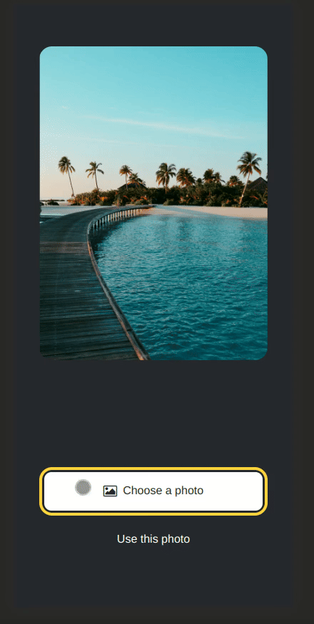

# StickerSmash


StickerSmash is a React Native application that allows users to add sticker to images.

It works on Android, iOS, and the Web.



## ✨ Features

- Add sticker to selected image.
- Touch gestures to pan and zoom the sticker.
- Save it to device.

## 🚀 Getting Started

Clone the repository:

```sh
git clone https://github.com/aravsanj/StickerSmash.git
```

```
npm run start
```

> [!important]
> You need either expo go app, or android / iOS similar depending on the machine.

## 🤝 Contribution

> [!note]
> This project was done strictly for learning purposes. There is no point in contribution.

## 📃 License

This project is licensed under AGPLv3, see [LICENSE](https://github.com/aravsanj/StickerSmash/blob/main/LICENSE).
